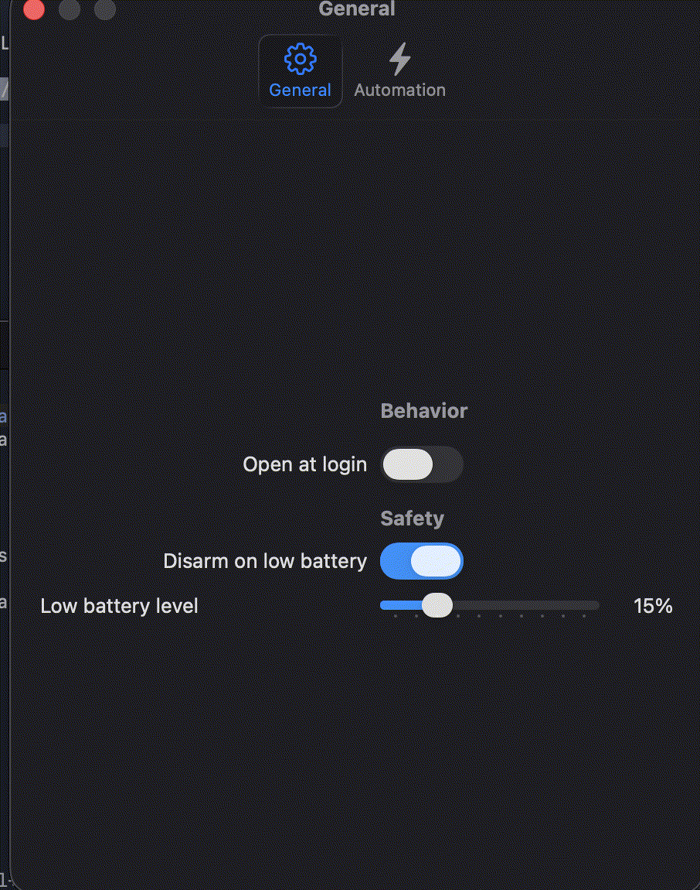

<p align="center">
  
</p>

<p align="center">
  <strong>A brilliant macOS menu bar utility to keep your Mac awake.</strong><br>
  <strong>Intelligent. Native. Lightweight.</strong>
</p>

<p align="center">
  <a href="https://developer.apple.com/swift/"></a>
  <a href="https://apple.com/macos"></a>
  <a href="https://github.com/repl-agastya-jha/Owl/blob/main/LICENSE"></a>
</p>

<p align="center">
  Formerly known as <em>LidAwake</em>, Owl is the most capable power-management utility that ships. Continuously tuned by real-world use — complete out of the box, native all the way down.
</p>

> [!NOTE]
> Owl requires passwordless sudo for `pmset` to operate natively without constantly prompting for your password. The build script handles printing the exact command you need.

## Install

**macOS · Source Build**

```sh
git clone https://github.com/repl-agastya-jha/Owl.git
cd Owl
./build.sh
```

> **Requirements:** Xcode Command Line Tools must be installed to compile the Swift source.

After building, simply drag `Owl.app` to your `/Applications` folder and run the one-time `pmset` configuration command printed to your terminal.

## The power utility _you love_, with **batteries included**.

### 01 · Smart App Automation

Most caffeinate apps require you to manually toggle them. Ours runs a persistent, highly-optimized background loop that watches your workspace. Open Xcode, Cursor, or Terminal, and Owl automatically arms itself. Close them, and it disarms. You never even have to click the menu bar.

### 02 · Battery Safety Lock, wired into every tick

A caffeinate utility is useless if it kills your Mac while it's in your backpack. Owl actively monitors your battery hardware. If your charge drops below your configured threshold (e.g., 15%) and the charger is disconnected, it forces a disarm. Automation is paused until you plug back in.

### 03 · Unapologetically native. Zero Electron.

Other tools ship heavy Chromium instances or cross-platform UI frameworks just to sit in your menu bar. We skipped that. Owl is written in 100% Swift and SwiftUI. It uses negligible memory and zero CPU cycles when idle. 

### 04 · Native Notifications

Your rules sit dormant until the automation goes off-script. When the state changes—whether you hit the global hotkey (`Cmd + Shift + L`) or an app triggers it—you get a beautiful, native macOS notification. You get course-correction without second-guessing if your Mac will go to sleep.

### 05 · Global Hotkeys

Drives a real background override. Press `Cmd + Shift + L` from absolutely anywhere in macOS, and Owl flips the switch. No need to hunt for the menu bar icon when you're deeply focused in a full-screen app.

## Screenshots



---
<p align="center">
  Created by <a href="https://github.com/repl-agastya-jha">repl-agastya-jha</a>
</p>
